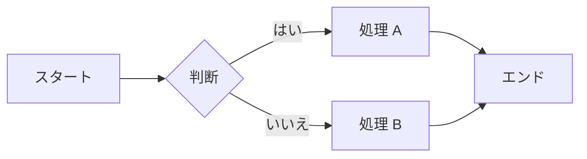
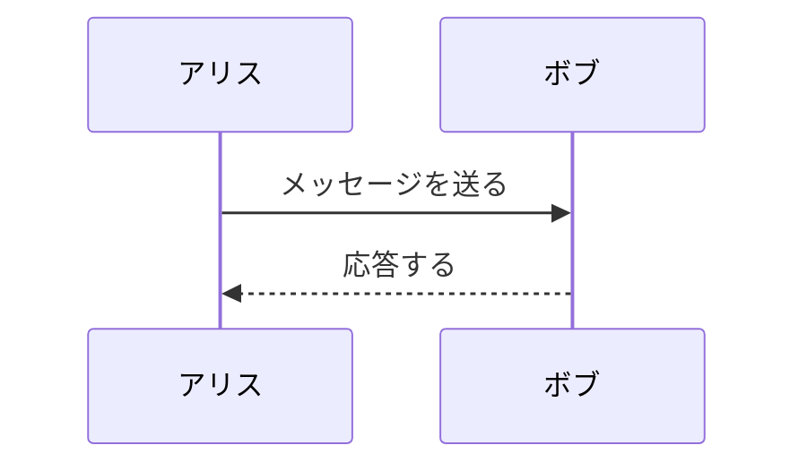
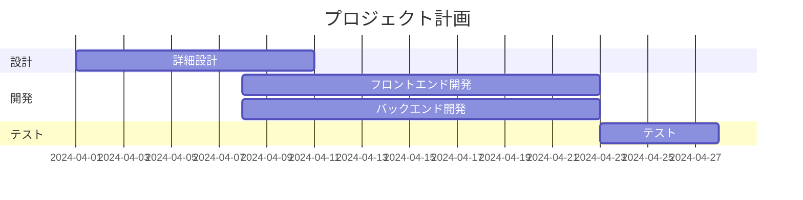
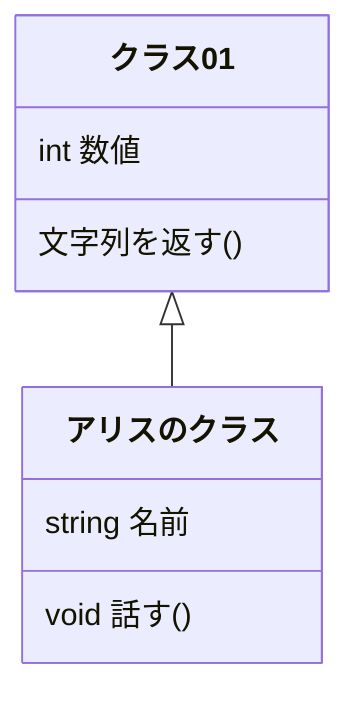

## 目次

<!-- TOC -->

- [目次](#目次)
- [mermaid のサンプル](#mermaid-のサンプル)
  - [フローチャート](#フローチャート)
  - [シーケンス図](#シーケンス図)
  - [ガントチャート](#ガントチャート)
  - [クラス図](#クラス図)
- [入れた拡張機能](#入れた拡張機能)

<!-- /TOC -->

## mermaid のサンプル

### フローチャート

### シーケンス図

### ガントチャート

### クラス図

## 入れた拡張機能

