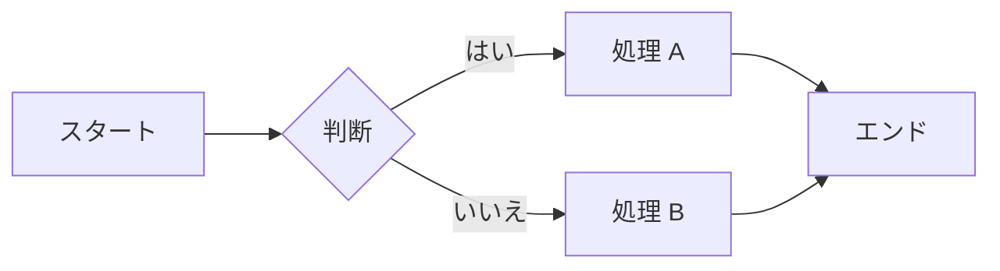
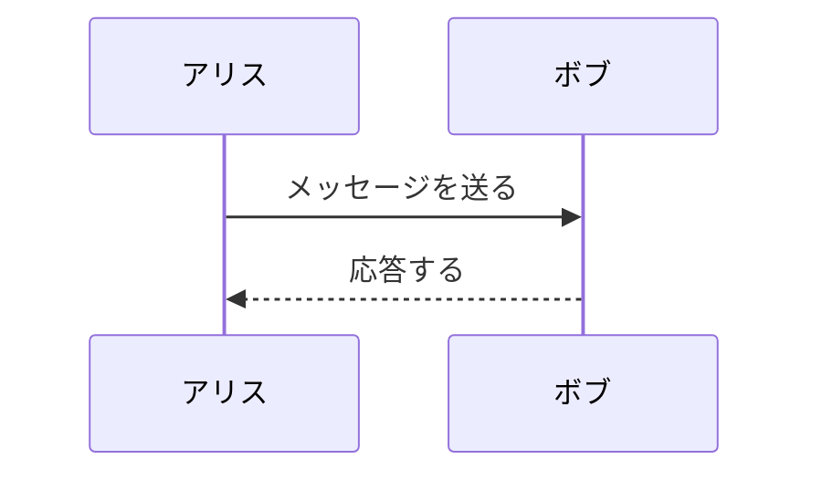
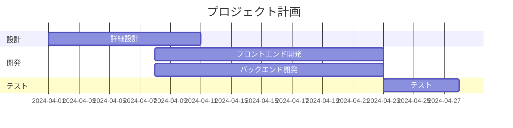
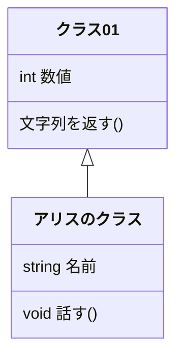

## 目次

<!-- TOC -->

- [目次](#目次)
- [mermaid のサンプル](#mermaid-のサンプル)
  - [フローチャート](#フローチャート)
  - [シーケンス図](#シーケンス図)
  - [ガントチャート](#ガントチャート)
  - [クラス図](#クラス図)
  - [入れた拡張機能](#入れた拡張機能)
  - [Mermaid Graphical Editor の使い方](#mermaid-graphical-editor-の使い方)
- [図解のルール](#図解のルール)
  - [mermaid](#mermaid)
  - [手書き](#手書き)
  - [参考資料](#参考資料)

<!-- /TOC -->

## mermaid のサンプル

### フローチャート



### シーケンス図



### ガントチャート



### クラス図



### 入れた拡張機能


### Mermaid Graphical Editor の使い方


[参考](https://ja.astahblog.com/2022/11/01/mermaid/)

## 図解のルール

### mermaid

```mermaid

```

### 手書き


### 参考資料

[なんでも図解 絵心ゼロでもできる！　爆速アウトプット術](https://www.diamond.co.jp/book/9784478110249.html)
