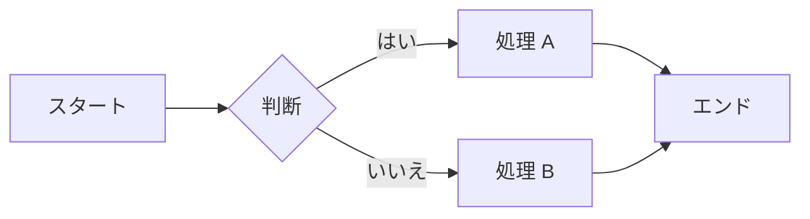
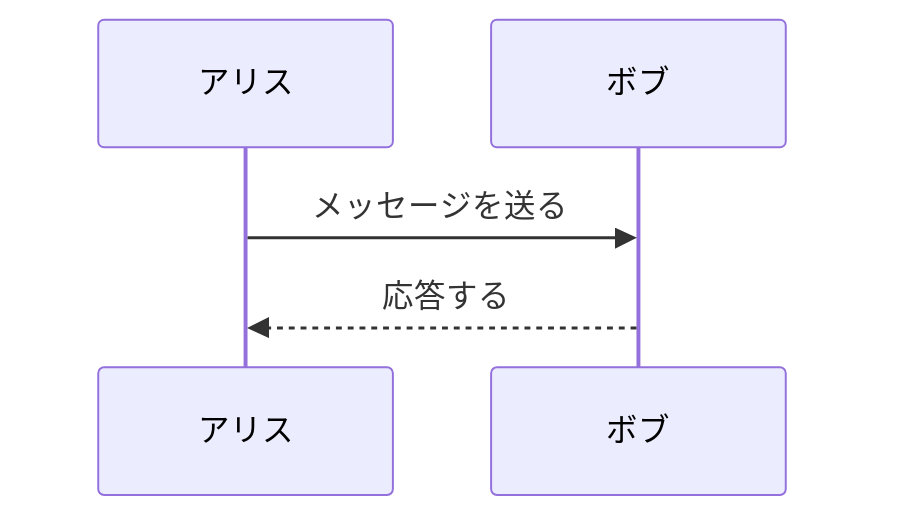
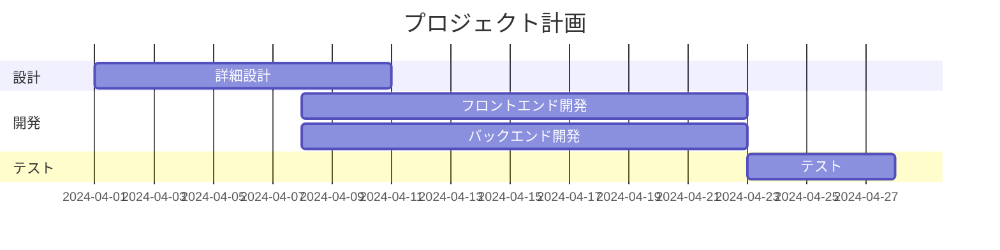
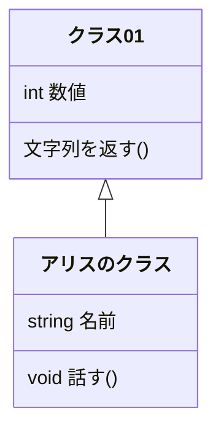
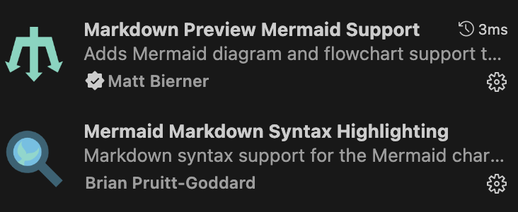
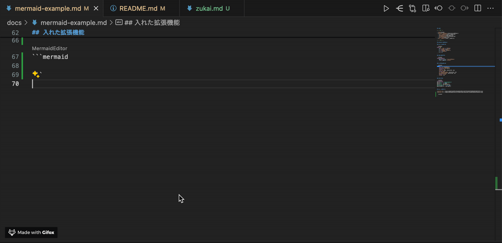
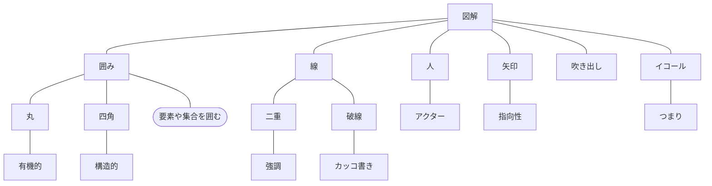
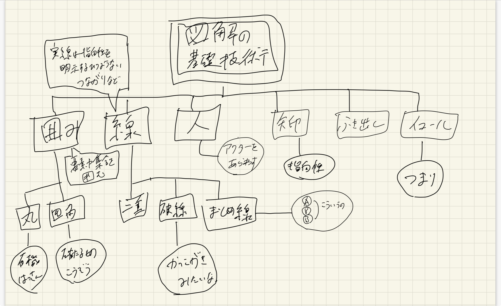

## 目次

<!-- TOC -->

- [目次](#目次)
- [概要](#概要)
- [mermaid のサンプル](#mermaid-のサンプル)
  - [フローチャート](#フローチャート)
  - [シーケンス図](#シーケンス図)
  - [ガントチャート](#ガントチャート)
  - [クラス図](#クラス図)
  - [入れた拡張機能](#入れた拡張機能)
  - [Mermaid Graphical Editor の使い方](#mermaid-graphical-editor-の使い方)
- [図解のルール](#図解のルール)
  - [mermaid](#mermaid)
  - [手書き](#手書き)
  - [参考資料](#参考資料)
- [Git のコミットメッセージ](#git-のコミットメッセージ)
  - [ドキュメントとの紐付け（重要）](#ドキュメントとの紐付け重要)
  - [具体](#具体)
- [backlog 課題のテンプレート](#backlog-課題のテンプレート)
- [issue のテンプレート](#issue-のテンプレート)
- [レビュー観点](#レビュー観点)
- [ファイルの命名ミス対策](#ファイルの命名ミス対策)
- [ファイルの分け方、検索性など](#ファイルの分け方検索性など)

<!-- /TOC -->

## 概要

- 組織課題
  - 業務課題
  - チーム課題
  - BizDev
  - ドキュメンテーション
  - 教育
- 現場で管理職や上流メンバとの雑談などから吸い上げ。

知見を溜めていく。検索性のためこの 1 ファイルにまとめる。

## mermaid のサンプル

### フローチャート

### シーケンス図

### ガントチャート

### クラス図

### 入れた拡張機能

### Mermaid Graphical Editor の使い方

[参考](https://ja.astahblog.com/2022/11/01/mermaid/)

## 図解のルール

### mermaid

### 手書き

### 参考資料

[なんでも図解 絵心ゼロでもできる！　爆速アウトプット術](https://www.diamond.co.jp/book/9784478110249.html)

## Git のコミットメッセージ

### ドキュメントとの紐付け（重要）

- 頭に機能番号や代表的なドキュメント番号をつける。
- プロジェクト管理のチームがあるなら先にルールを聞いておく。
- **コミットメッセージの詳細よりも重要**

### 具体

- 経験上の意見

  - あまりコミットメッセージの細かいことで改善や、問題が起きることはなさそう。
  - 丁寧に書いても、詳細は結局メンバーに聞くことが多い。
  - なので拘らない。他に方針があればそちらで OK。
  - rebase で log を整えるくらいなら組織や PJ の課題に時間を使うべき（これも拘らない）

- 前提
  - 日本語で書く
  - 英字は小文字で始める
  - commit lint を使うとログが汚くなりにくい。（経験浅メンバーに stash の方法は伝える）
- 具体
  - build: ビルドシステムや外部依存関係の変更
  - chore: 雑用。ビルドプロセスや補助ツールの変更
  - ci: CI の設定やスクリプトの変更
  - docs: ドキュメントのみの変更
  - feat: 新機能の追加
  - fix: バグ修正
  - perf: パフォーマンスを向上させるコードの変更
  - refactor: リファクタリング
  - revert: コードの変更を取り消す
  - style: コードの意味に影響を与えない変更（空白、フォーマット、セミコロンの欠落など）
  - test: テストの追加、変更、削除

## backlog 課題のテンプレート

## issue のテンプレート

## レビュー観点

## ファイルの命名ミス対策

## ファイルの分け方、検索性など
