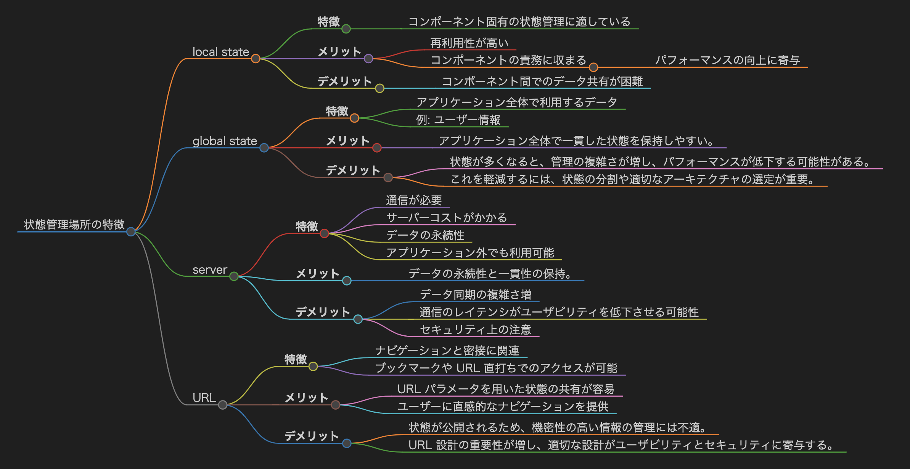
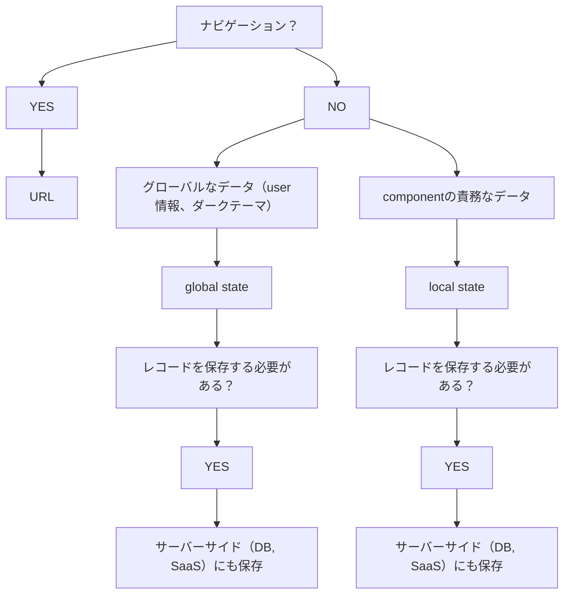

## 目次

<!-- TOC -->

- [目次](#目次)
- [概要](#概要)
- [storybook の導入、活用](#storybook-の導入活用)
- [良い感じの API クライアント](#良い感じの-api-クライアント)
- [状態を保つ場所](#状態を保つ場所)
- [フロントエンド状態管理](#フロントエンド状態管理)
- [コンポーネント設計、ディレクトリ構成](#コンポーネント設計ディレクトリ構成)
- [アトミックデザインの崩し方](#アトミックデザインの崩し方)
- [フロントエンドテスト設計](#フロントエンドテスト設計)
- [E2E テスト](#e2e-テスト)
- [CI/CD](#cicd)
- [フロントエンドビルド設定](#フロントエンドビルド設定)
- [アクセシビリティ](#アクセシビリティ)
- [設計](#設計)
- [SSR と CSR の使い分け](#ssr-と-csr-の使い分け)
- [Cookie, LocalStorage, SessionStorage の使い分け](#cookie-localstorage-sessionstorage-の使い分け)

<!-- /TOC -->

## 概要

- 技術課題解決のアウトプット。出口は提案。
- エディタの config などリポジトリを問わないもの。をコピペできる状態に。
- 現場で管理職や上流メンバとの雑談などから吸い上げ。
- 抽象度高め。具体的なエラーなどのノウハウはブログや各技術リポジトリへ。

## storybook の導入、活用

- 具体
  - フロントエンドフレームワークのリポジトリに作成する
- 方針

  - ディレクトリ構成
    - storybook 専用で新規に切らない
    - 例
      - Button
        - index.tsx
        - Button.spec.tsx
        - Button.stories.tsx
        - styles.module.css
  - ほぼ自動化
    - テンプレをコピーして 1 行いじるくらいにする = テンプレ作る
  - スナップショットテストで自動リグレッションテスト
    - スナップショットテストはコンポーネントではなく、storybook に使うと良い
  - スナップショットテストの実行方針
    - プッシュ時に husky で実行が良さそう
      - ローカルで重くなったらテストスイートの分割が必要になりそう
      - CI も実行した方が良いは良いが、CI で使う金額や時間を考慮する。本番環境とその前の環境くらいで良いかも。

- 参考記事
  - https://zenn.dev/sum0/articles/9463d16d9d40e2

## 良い感じの API クライアント

- openapi-generator は微妙
- swr は良い?

## 状態を保つ場所

ざっくりとした基礎。
他にも Cookie, LocalStorage, SessionStorage など考慮しないといけない。

|   状態の種類   | 特徴                                   | メリット                                                                     | デメリット                                                                     |
| :------------: | :------------------------------------- | :--------------------------------------------------------------------------- | :----------------------------------------------------------------------------- |
|  ローカル状態  | コンポーネント内で完結する状態。       | 再利用性が高く、パフォーマンスが良好。 コンポーネントの責務に収まる。     | コンポーネント間でのデータ共有が困難。                                         |
| グローバル状態 | アプリケーション全体で共有される状態。 | アプリケーション全体で利用するデータ（例: ユーザー情報）の管理に適している。 | 状態が多くなるとバグの温床になり、パフォーマンスが低下する可能性がある。       |
|  サーバー状態  | バックエンドと同期が必要な状態。       | データの永続性を保ち、アプリケーション外でも利用可能。                       | 通信が必要であり、サーバーコストがかかる。ユーザビリティが低下することがある。 |
|    URL 状態    | ブラウザの URL に依存する状態。        | ナビゲーションと密接に関連し、ブックマークや URL 直打ちでのアクセスが可能。  | 状態が公開されるため、機密性の高い情報の管理には不適。複雑性が増すことがある。 |

## フロントエンド状態管理

## コンポーネント設計、ディレクトリ構成

## アトミックデザインの崩し方

## フロントエンドテスト設計

## E2E テスト

## CI/CD

## フロントエンドビルド設定

## アクセシビリティ

## 設計

## SSR と CSR の使い分け

## Cookie, LocalStorage, SessionStorage の使い分け
