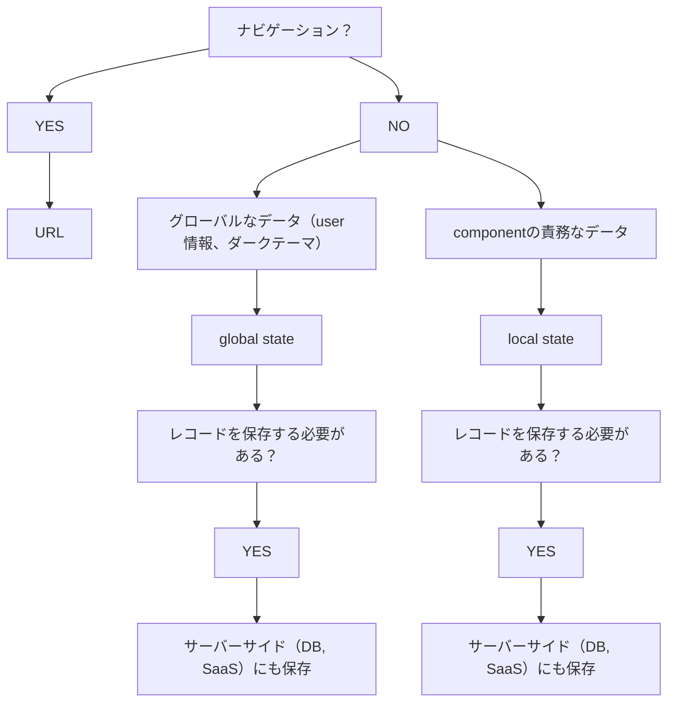
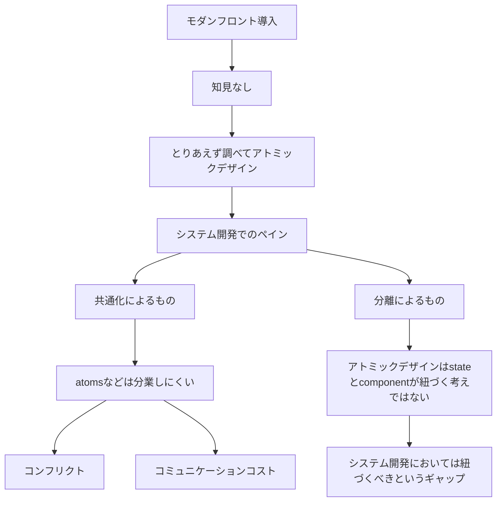
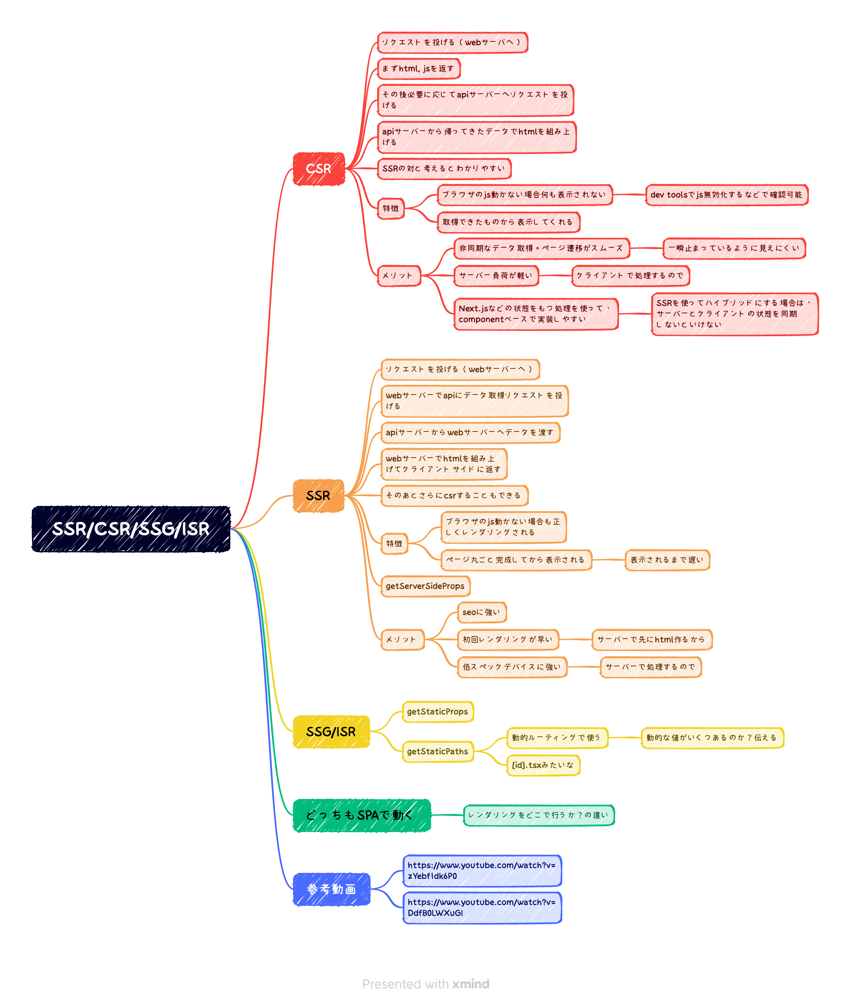

## 目次

<!-- TOC -->

    - [目次](#目次)
    - [概要](#概要)
    - [storybook の導入、活用](#storybook-の導入活用)
    - [状態管理](#状態管理)
        - [概要](#概要)
        - [保存場所選定フローチャート](#保存場所選定フローチャート)
    - [コンポーネント設計](#コンポーネント設計)
        - [Next.js](#nextjs)
        - [Nuxt.js](#nuxtjs)
    - [アトミックデザインについて](#アトミックデザインについて)
    - [SSR と CSR の使い分け](#ssr-と-csr-の使い分け)
    - [良い感じの API クライアント](#良い感じの-api-クライアント)
- [目次](#目次)
- [概要](#概要)
- [storybook の導入、活用](#storybook-の導入活用)
- [状態管理](#状態管理)
  - [概要](#概要-1)
  - [保存場所選定フローチャート](#保存場所選定フローチャート)
- [コンポーネント設計](#コンポーネント設計)
  - [Next.js](#nextjs)
  - [Nuxt.js](#nuxtjs)
- [アトミックデザインについて](#アトミックデザインについて)
- [SSR と CSR の使い分け](#ssr-と-csr-の使い分け)
- [良い感じの API クライアント](#良い感じの-api-クライアント)
- [フロントエンドディレクトリ構成、コンポーネント以外](#フロントエンドディレクトリ構成コンポーネント以外)
- [フロントエンドテスト設計](#フロントエンドテスト設計)
- [E2E テスト](#e2e-テスト)
- [CI/CD](#cicd)
- [フロントエンドビルド設定](#フロントエンドビルド設定)
- [アクセシビリティ](#アクセシビリティ)
- [設計](#設計)
- [Cookie, LocalStorage, SessionStorage の使い分け](#cookie-localstorage-sessionstorage-の使い分け)
- [Websocket, Webhook, api polling の使い分け](#websocket-webhook-api-polling-の使い分け)
- [SaaS と DB の使い分け](#saas-と-db-の使い分け)
- [フロントエンドのパフォーマンス（遅延ローディング, メモ化, バッチ更新、そもそも論の非効率なコードがないか、useEffect）](#フロントエンドのパフォーマンス遅延ローディング-メモ化-バッチ更新そもそも論の非効率なコードがないかuseeffect)
- [Rest API の設計](#rest-api-の設計)
- [GraphQL の設計](#graphql-の設計)
- [REST API と GraphQL の使い分け](#rest-api-と-graphql-の使い分け)
- [NoSQL と RDB の使い分け](#nosql-と-rdb-の使い分け)
- [NoSQL の設計](#nosql-の設計)
- [RDB の設計](#rdb-の設計)
- [フロントエンドのセキュリティ](#フロントエンドのセキュリティ)
- [他システム連携が多い場合のテスト設計](#他システム連携が多い場合のテスト設計)

<!-- /TOC -->

## 概要

- 技術課題解決のアウトプット。出口は提案。
- エディタの config などリポジトリを問わないもの。をコピペできる状態に。
- 現場で管理職や上流メンバとの雑談などから吸い上げ。
- 抽象度高め。具体的なエラーなどのノウハウはブログや各技術リポジトリへ。

## storybook の導入、活用

- 具体
  - フロントエンドフレームワークのリポジトリに作成する
- 方針

  - ディレクトリ構成
    - storybook 専用で新規に切らない
    - 例
      - Button
        - index.tsx
        - Button.spec.tsx
        - Button.stories.tsx
        - styles.module.css
  - ほぼ自動化
    - テンプレをコピーして 1 行いじるくらいにする = テンプレ作る
  - スナップショットテストで自動リグレッションテスト
    - スナップショットテストはコンポーネントではなく、storybook に使うと良い
  - スナップショットテストの実行方針
    - プッシュ時に husky で実行が良さそう
      - ローカルで重くなったらテストスイートの分割が必要になりそう
      - CI も実行した方が良いは良いが、CI で使う金額や時間を考慮する。本番環境とその前の環境くらいで良いかも。

- 参考記事
  - https://zenn.dev/sum0/articles/9463d16d9d40e2

## 状態管理

ざっくりとした基礎。  
他にも Cookie, LocalStorage, SessionStorage など考慮しないといけない。  
SaaS にある情報を DB に保存するかなど。

### 概要

|   状態の種類   | 特徴                                   | メリット                                                                     | デメリット                                                                     |
| :------------: | :------------------------------------- | :--------------------------------------------------------------------------- | :----------------------------------------------------------------------------- |
|  ローカル状態  | コンポーネント内で完結する状態。       | 再利用性が高く、パフォーマンスが良好。<br>コンポーネントの責務に収まる。     | コンポーネント間でのデータ共有が困難。                                         |
| グローバル状態 | アプリケーション全体で共有される状態。 | アプリケーション全体で利用するデータ（例: ユーザー情報）の管理に適している。 | 状態が多くなるとバグの温床になり、パフォーマンスが低下する可能性がある。       |
|  サーバー状態  | バックエンドと同期が必要な状態。       | データの永続性を保ち、アプリケーション外でも利用可能。                       | 通信が必要であり、サーバーコストがかかる。ユーザビリティが低下することがある。 |
|    URL 状態    | ブラウザの URL に依存する状態。        | ナビゲーションと密接に関連し、ブックマークや URL 直打ちでのアクセスが可能。  | 状態が公開されるため、機密性の高い情報の管理には不適。複雑性が増すことがある。 |

### 保存場所選定フローチャート



## コンポーネント設計

### Next.js

```bash
src/
├── components/                    # 再利用可能なコンポーネント群
│   ├── features/                  # 特定の機能を提供するコンポーネント群
│   │   ├── UserProfile/           # ユーザープロファイル機能に関連するコンポーネント
│   │   │   ├── index.tsx          # ユーザープロファイルコンポーネント本体
│   │   │   ├── index.stories.tsx  # Storybook用のストーリーファイル
│   │   │   └── index.test.tsx     # ユニットテストとスナップショットテスト(E2Eは含まず)
│   │   └── TodoList/              # ToDoリスト機能に関連するコンポーネント
│   │       ├── index.tsx          # ToDoリストコンポーネント本体
│   │       ├── index.stories.tsx  # Storybook用のストーリーファイル
│   │       └── index.test.tsx     # ユニットテストとスナップショットテスト
│   └── ui/                        # UIフレームワークを使用しない場合の基本UIコンポーネント
│       └── Button/                # ボタンコンポーネント
│           ├── index.tsx          # ボタンコンポーネント本体
│           ├── index.stories.tsx  # Storybook用のストーリーファイル
│           └── index.test.tsx     # ユニットテストとスナップショットテスト(E2Eは含まず)
├── pages/                         # ページコンポーネント、Next.jsのルーティングに対応
│   ├── _app.tsx                   # アプリケーションのメインレイアウト定義（Next.jsの場合）
│   └── index.tsx                  # ホームページコンポーネント
└── styles/                        # グローバルスタイル定義
    └── globals.css                # CSSでのグローバルスタイル定義

```

### Nuxt.js

```bash
src/
├── components/
│   ├── features/
│   │   ├── UserProfile/
│   │   │   ├── UserProfile.vue                 # コンポーネント本体
│   │   │   ├── UserProfile.stories.ts          # Storybook用のストーリーファイル
│   │   │   └── UserProfile.spec.ts             # スナップショットテスト、コンポーネントのテスト
│   │   └── TodoList/                     # ToDoリスト機能に関連するコンポーネント
│   │       ├── index.vue                 # コンポーネント本体
│   │       ├── index.stories.ts          # Storybook用のストーリーファイル
│   │       └── index.spec.ts             # スナップショットテスト、コンポーネントのテスト
│   └── ui/                               # オプショナル: UIフレームワークを使う場合は削除可
│       └── Button/                       # ボタンコンポーネント
│           ├── index.vue                 # コンポーネント本体
│           ├── index.stories.ts          # Storybook用のストーリーファイル
│           └── index.spec.ts             # スナップショットテスト、コンポーネントのテスト
├── pages/                                # ページコンポーネント、Nuxt.jsのルーティングに対応
│   ├── index.vue                         # ホームページ
└── assets/                               # グローバルスタイル定義
    └── css/                              # グローバルスタイル定義
        └── globals.css                   # グローバルスタイルシート

```

index.vue は stylelint に怒られた

## アトミックデザインについて

- あるあるな課題
  - フロントエンドの知見がないから、とりあえずアトミックデザインを導入
  - システム開発でのペイン
    - atoms など大きく共通化されたコンポーネントは分業しにくい
      - コンフリクトが起きやすい
      - コミュニケーションコストが高い
      - 変更の追跡が難しい
    - コンポーネントと state が紐づく考え方ではない
      - システム開発においては、進めにくい
      - Web 制作やデザインの分野では有用
- おすすめは[コチラ](#コンポーネント設計)



## SSR と CSR の使い分け



## 良い感じの API クライアント

```bash
# - openapi-generator は微妙
# - swr は良い?
```

## フロントエンドディレクトリ構成、コンポーネント以外

## フロントエンドテスト設計

## E2E テスト

## CI/CD

## フロントエンドビルド設定

## アクセシビリティ

## 設計

## Cookie, LocalStorage, SessionStorage の使い分け

## Websocket, Webhook, api polling の使い分け

## SaaS と DB の使い分け

## フロントエンドのパフォーマンス（遅延ローディング, メモ化, バッチ更新、そもそも論の非効率なコードがないか、useEffect）

## Rest API の設計

## GraphQL の設計

## REST API と GraphQL の使い分け

## NoSQL と RDB の使い分け

## NoSQL の設計

## RDB の設計

## フロントエンドのセキュリティ

## 他システム連携が多い場合のテスト設計
